# Rubik's-RL — Design Requirement Document

> **Status:** Approved · design locked   **Version:** 1.0
> **Learner:** ADI / DeepCubeA   **Hard deps:** PyTorch only   **License intent:** Open source

The single source of truth for an open-source 3×3 Rubik's Cube solver: a
dependency-free cube core, a PyTorch ADI learner, and a framework-free browser
playground — specified end to end, with the contracts, data-flows, workflows,
and milestones every contributor needs before writing a line of code.

---

## 00 · About this document

This DRD is the reference the whole project is built against. It is organised in
three arcs — **System** (what we're building and why), **Contracts** (the exact
interfaces and data shapes each subsystem must honour), and **Build** (repository,
dependencies, workflows, testing, roadmap). Every major part carries a diagram so
the structure is legible at a glance.

> **◆ Diagram rendering.** All graphs are written in **Mermaid** in fenced
> ` ```mermaid ` blocks. They render automatically on **GitHub** and in **VS Code**
> (Markdown Preview Mermaid Support), and read cleanly as text for Claude Code. If
> a viewer shows raw diagram text, it simply lacks a Mermaid renderer.

**Colour legend (consistent across every diagram and the repo tree):**

| colour | meaning |
|---|---|
| 🟩 green | Core + Env (pure) |
| 🟦 blue | RL stack (torch) |
| 🟧 orange | Presentation (browser) |
| 🟨 yellow | gate / decision |
| 🟥 red | anti-pattern / risk |

### Table of contents

**System** — [01 Purpose & scope](#01--purpose--scope) · [02 Glossary](#02--glossary) · [03 Overview & philosophy](#03--system-overview--philosophy) · [04 Architecture](#04--architecture) · [05 The core difficulty](#05--the-core-difficulty--and-why-adi)
**Contracts** — [06 State](#06--state-representation-contract--d1) · [07 Moves](#07--move-system-contract--d2) · [08 Environment](#08--environment-contract--d4) · [09 RL pipeline](#09--rl-pipeline--autodidactic-iteration--d3) · [10 Parallelism](#10--parallelism--scaling) · [11 Time control](#11--time--speed-control--d7) · [12 Checkpoints](#12--checkpoint-schema--pause-save-resume) · [13 Presentation](#13--presentation-layer--d5--d6)
**Build** — [14 Repository layout](#14--repository-layout) · [15 Dependencies](#15--dependencies) · [16 Extension workflows](#16--extension-workflows) · [17 Testing](#17--testing-strategy) · [18 Roadmap](#18--roadmap--milestones) · [19 Risks](#19--risks--open-questions) · [20 Future extensions](#20--future-extensions)

---

## 01 · Purpose & Scope

**Build an agent that learns to solve a 3×3 Rubik's Cube on its own**, package it
so anyone can run it and watch it solve, and write the whole thing clearly enough
that the next person can extend it without frustration.

That last clause is a first-class requirement, not a nicety. The original attempt
stalled precisely because reference projects were opaque — no comments, no
rationale for a dependency, no map. This project treats **readability and
documentation as deliverables** equal to the model itself.

### Goals

- **Self-taught solving.** The agent learns a solving policy through RL, not by executing hand-coded human algorithms.
- **Full control of the environment.** The cube, its state, and its moves are built from scratch for total control and zero black-box behaviour.
- **Massively parallel by design.** Run an arbitrary number of agents (1 → device limit) cheaply, because the environment is vectorized.
- **Pause / save / resume.** Stop a run at any moment and resume it later with no loss of progress or reproducibility.
- **Decoupled speed.** Train as fast as the hardware allows; replay episodes at any speed to watch them.
- **A real, colored, rotatable cube** in the browser — animated turns, viewable from any angle, manually scrambleable by the user.
- **Minimal, justified dependencies** and heavy commenting, so the repo doubles as a teaching reference.

### Non-goals (explicitly out of scope for v1)

- **Optimal-length solutions.** We want *solving*, not God's-number-optimal solving. Optimality is a later, optional eval concern.
- **Larger cubes (4×4+).** The cubie model generalises, but v1 targets 3×3 only.
- **A hosted multi-user service.** The playground is client-side; no accounts, no server-side persistence.
- **Rule-based / algorithm-driven solving** as the core method. Classical algorithms appear only as an optional warm-start signal (§09), never as the policy.
- **Photorealistic 3D.** CSS 3D is the target; WebGL is a future option only.

### Success criteria

| # | Criterion | Measured by |
|---|---|---|
| SC-1 | Cube logic is provably correct | Move-algebra invariants pass (§17) |
| SC-2 | Agent solves scrambles it never trained on | Solve-rate vs. scramble depth climbs with training |
| SC-3 | Runs scale with workers | Moves/sec scales near-linearly with N on one device |
| SC-4 | Pause/resume is lossless | Resumed run reproduces the paused run's trajectory |
| SC-5 | A non-technical user can watch a solve | Open `index.html` → animated solve, no install |

---

## 02 · Glossary

| Term | Meaning |
|---|---|
| **Cubie** | A physical movable piece of the cube: 8 *corner* cubies (3 stickers each) and 12 *edge* cubies (2 stickers each). Centers are fixed and not modelled as movable. |
| **Permutation** | Which slot each cubie currently occupies — an arrangement of pieces. An integer array. |
| **Orientation** | How a cubie is twisted/flipped in its slot. Corners twist mod 3; edges flip mod 2. |
| **State** | The complete configuration: four integer arrays (corner perm/orient, edge perm/orient). The source of truth. |
| **Move** | A named transformation of the state, implemented as a fixed index permutation. E.g. `R`, `U'`, `F2`. |
| **Action space** | The subset of moves the *agent* may choose from — the 18 face turns. |
| **Cost-to-go** | An estimate of how many moves a state is from solved. The value network learns this; search uses it as a heuristic. |
| **ADI** | *Autodidactic Iteration* — DeepCubeA's training method. Generates depth-labeled states by scrambling backward from solved, then trains a value/policy net. |
| **Oracle** | Any function trusted to return a correct solution (e.g. a classical solver). Used here only to optionally generate expert data — never in the live policy. |
| **Expert trajectory** | A sequence of (state → move) pairs along a correct solution, usable for behaviour cloning. |
| **Vectorized env** | An environment that holds N cubes in one tensor and steps them all with a single batched operation. |
| **Episode** | One solve attempt: a start state, the sequence of moves taken, and the per-step states. The unit of recording and replay. |
| **Generation / checkpoint** | A saved snapshot of the full run state (weights + optimizer + buffer + RNG + curriculum + meta), enabling pause/resume. |

---

## 03 · System Overview & Philosophy

The system is one project of three subsystems that must never bleed into each
other. A single dependency rule is what keeps it testable, fast, and readable.

The boundaries follow the natural seams of the problem. Cube mechanics are pure
mathematics and need nothing but Python. Learning needs a GPU autodiff engine and
nothing about the browser. Presentation needs a browser and nothing about tensors.
Drawing the lines along those seams means each subsystem can be understood,
tested, swapped, or rewritten *in isolation*.

| 🟩 Cube Core + Env | 🟦 RL Stack | 🟧 Presentation |
|---|---|---|
| Owns state, moves, scramble, goal-check, and the vectorized environment. No torch, no web. The part the next person reads first. | Consumes the env. Owns networks, the ADI loop, search, checkpoints, parallel actors. The only place GPU code lives. | Renders a colored cube from a state vector and replays / streams episodes. Knows nothing about PyTorch. |

> **◆ The dependency rule — non-negotiable.** `core/` and `env/` import nothing
> heavy. PyTorch enters only in `rl/`. The browser never imports Python logic — it
> consumes serialized state (JSON). Dependencies always point *inward* toward the
> pure core; nothing the core depends on depends back on its consumers.

---

## 04 · Architecture

At runtime, data flows down: the core produces state, the RL stack turns
experience into solutions, and the presentation layer renders them. But the
*dependency* arrows only ever point one way — toward the pure core.

**FIG 04.1 — System architecture: three layers & the data crossing each boundary**

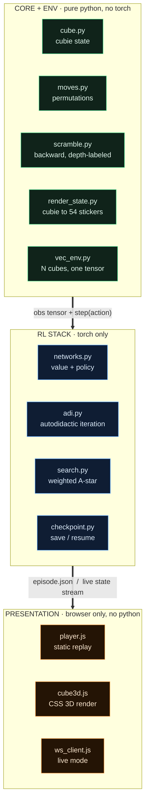
```mermaid
graph TB
  subgraph CORE["CORE + ENV  ·  pure python, no torch"]
    direction LR
    cube["cube.py<br/>cubie state"]
    moves["moves.py<br/>permutations"]
    scr["scramble.py<br/>backward, depth-labeled"]
    rs["render_state.py<br/>cubie to 54 stickers"]
    venv["vec_env.py<br/>N cubes, one tensor"]
  end
  subgraph RL["RL STACK  ·  torch only"]
    direction LR
    net["networks.py<br/>value + policy"]
    adi["adi.py<br/>autodidactic iteration"]
    search["search.py<br/>weighted A-star"]
    ckpt["checkpoint.py<br/>save / resume"]
  end
  subgraph PRES["PRESENTATION  ·  browser only, no python"]
    direction LR
    player["player.js<br/>static replay"]
    cube3d["cube3d.js<br/>CSS 3D render"]
    wsc["ws_client.js<br/>live mode"]
  end
  CORE ==>|"obs tensor + step(action)"| RL
  RL  ==>|"episode.json  /  live state stream"| PRES
  classDef core fill:#10231a,stroke:#46d98a,color:#dff7ea,stroke-width:1px;
  classDef rl fill:#0f1d33,stroke:#54a0ff,color:#dcecff,stroke-width:1px;
  classDef pres fill:#241405,stroke:#ff9d42,color:#ffe6cc,stroke-width:1px;
  class cube,moves,scr,rs,venv core;
  class net,adi,search,ckpt rl;
  class player,cube3d,wsc pres;
```

The crucial property: the boundary between RL and Presentation is a **serialized
artifact** (a JSON episode or a state message), not a function call. That single
fact is what lets the playground ship with zero backend — a browser reads a
recorded file and plays it.

### Module dependency graph

Within the codebase, imports flow strictly one direction. No torch module ever
points back into `core`, and the browser endpoints sit downstream of a serialized
file.

**FIG 04.2 — Module-level import dependencies (arrow = "imports / feeds")**

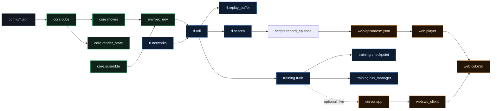
```mermaid
graph LR
  cfg["config/*.json"] --> cube["core.cube"]
  cube --> moves["core.moves"]
  cube --> rs["core.render_state"]
  scr["core.scramble"] --> venv["env.vec_env"]
  moves --> venv
  venv --> adi["rl.adi"]
  net["rl.networks"] --> adi
  adi --> buf["rl.replay_buffer"]
  adi --> search["rl.search"]
  adi --> train["training.train"]
  train --> ckpt["training.checkpoint"]
  train --> rm["training.run_manager"]
  search --> rec["scripts.record_episode"]
  rec --> ep["web/episodes/*.json"]
  ep --> player["web.player"]
  player --> c3d["web.cube3d"]
  train -. "optional, live" .-> srv["server.app"]
  srv --> wsc["web.ws_client"]
  wsc --> c3d
  classDef core fill:#10231a,stroke:#46d98a,color:#dff7ea;
  classDef rl fill:#0f1d33,stroke:#54a0ff,color:#dcecff;
  classDef pres fill:#241405,stroke:#ff9d42,color:#ffe6cc;
  classDef neu fill:#13171f,stroke:#3a4658,color:#aab3c2;
  class cube,moves,rs,scr,venv core;
  class net,adi,buf,search,train,ckpt,rm rl;
  class ep,player,c3d,wsc,srv pres;
  class cfg neu;
```

---

## 05 · The Core Difficulty — and Why ADI

> **⚠ The trap that kills most hobby attempts.** "Reward the agent more as it gets
> *closer* to solved" assumes closeness is cheap to measure. It is not — computing
> true distance-to-solved **is the entire problem**. The 3×3 state space is
> ~4.3×10¹⁹; God's number is 20. An agent rewarded only on reaching the solved
> state will, over a deep random scramble, **never reach it by chance**, so the
> signal is always zero and nothing is learned.

Every method that actually works defeats this *reward sparsity* the same way: it
generates training data **from the solved state outward**, so distance is known by
construction rather than measured.

**FIG 05.1 — Why naive sparse reward fails, and how ADI sidesteps it**

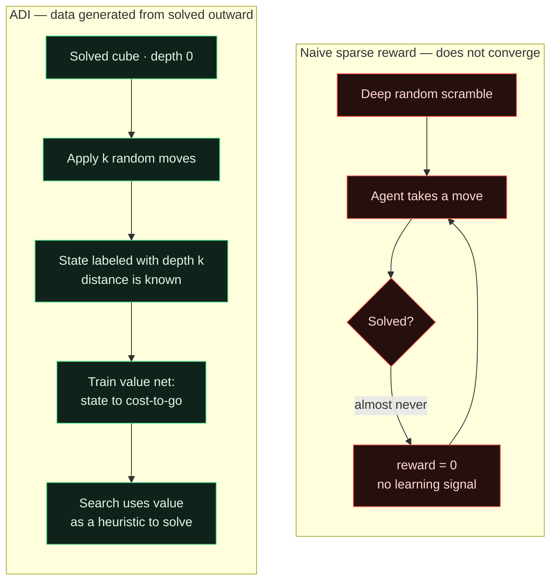
```mermaid
graph TD
  subgraph NAIVE["Naive sparse reward  —  does not converge"]
    direction TB
    n1["Deep random scramble"] --> n2["Agent takes a move"]
    n2 --> n3{"Solved?"}
    n3 -->|"almost never"| n4["reward = 0<br/>no learning signal"]
    n4 --> n2
  end
  subgraph ADIG["ADI  —  data generated from solved outward"]
    direction TB
    a1["Solved cube · depth 0"] --> a2["Apply k random moves"]
    a2 --> a3["State labeled with depth k<br/>distance is known"]
    a3 --> a4["Train value net:<br/>state to cost-to-go"]
    a4 --> a5["Search uses value<br/>as a heuristic to solve"]
  end
  classDef bad fill:#26100e,stroke:#ff5d52,color:#ffd9d5;
  classDef good fill:#10231a,stroke:#46d98a,color:#dff7ea;
  class n1,n2,n3,n4 bad;
  class a1,a2,a3,a4,a5 good;
```

| Approach | Mechanism | Defeats sparsity by | Verdict |
|---|---|---|---|
| **ADI / DeepCubeA** | Scramble backward from solved → train value for cost-to-go → solve with weighted A* / MCTS | Training data is depth-labeled at generation time | ✅ **CORE** |
| Curriculum | Start at 1-move scrambles; deepen as success-rate rises | Agent always starts near the goal | 🟧 LATER |
| HER | Relabel a failed trajectory's final state as the goal reached | Every episode yields usable signal | 🟧 LATER |
| Sparse PPO / DQN | +1 on solve over deep scrambles, nothing else | It doesn't | 🟥 DROP |

> **◆ Build order, not exclusivity.** Curriculum and HER aren't rejected — they're
> **Phase 7**, added later as alternate learners behind one common `Trainer`
> interface so different agents can run different strategies and be compared
> head-to-head. Writing that interface now (§16) is what keeps the expansion cheap.
> v1 ships ADI alone.

---

## 06 · State Representation Contract · D1

A cube is not 54 independent stickers; it is **20 movable pieces** whose stickers
travel together. Modelling the pieces directly (the "cubie" representation) makes
a move a fixed index permutation — which gives an O(1) solved-check and lets us
step 1,000 cubes with one tensor op (§10).

**FIG 06.1 — CubeState contract and its derived sticker view**

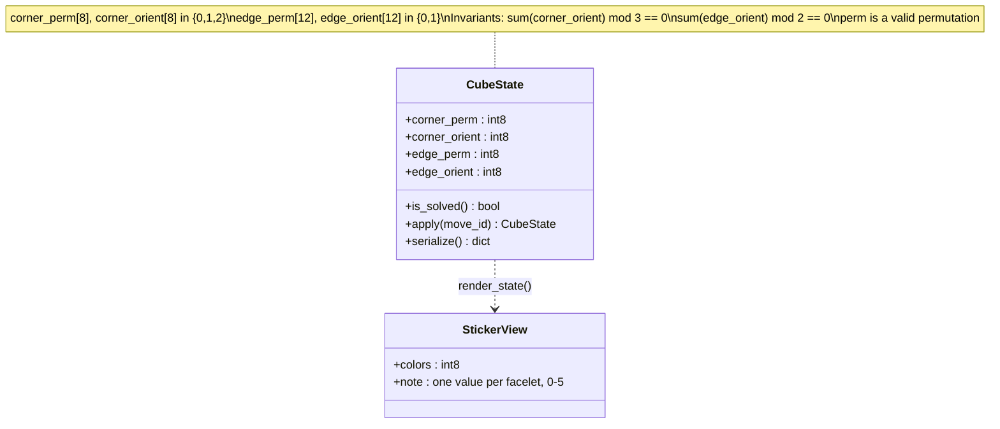
```mermaid
classDiagram
  class CubeState {
    +corner_perm : int8
    +corner_orient : int8
    +edge_perm : int8
    +edge_orient : int8
    +is_solved() bool
    +apply(move_id) CubeState
    +serialize() dict
  }
  class StickerView {
    +colors : int8
    +note : one value per facelet, 0-5
  }
  CubeState ..> StickerView : render_state()
  note for CubeState "corner_perm[8], corner_orient[8] in {0,1,2}\nedge_perm[12], edge_orient[12] in {0,1}\nInvariants: sum(corner_orient) mod 3 == 0\nsum(edge_orient) mod 2 == 0\nperm is a valid permutation"
```

The full state is four small integer arrays. **Solved-check is a single
comparison** — `perm == identity ∧ orient == 0` — needing no solver. Centers never
move under face turns, which is exactly what gives the cube its canonical fixed
orientation and keeps the check trivial.

```jsonc
// core/cube.py — the canonical serialized form (also the JSON wire format)
{
  "cp": [0,1,2,3,4,5,6,7],            // corner_perm   · which corner sits in each of 8 slots
  "co": [0,0,0,0,0,0,0,0],            // corner_orient · twist, each in {0,1,2}  (mod 3)
  "ep": [0,1,2,3,4,5,6,7,8,9,10,11],  // edge_perm     · which edge sits in each of 12 slots
  "eo": [0,0,0,0,0,0,0,0,0,0,0,0]     // edge_orient   · flip, each in {0,1}     (mod 2)
}
// the array above is the SOLVED state (identity permutation, zero orientation)
```

### One projection, two consumers

The cubie arrays are the source of truth. A single function, `render_state()`,
projects them into a 54-facelet color grid — the form both the neural network's
input encoder and the browser renderer consume. Nothing trains on the cubie arrays
directly except through this projection.

**FIG 06.2 — State → projection → consumers**

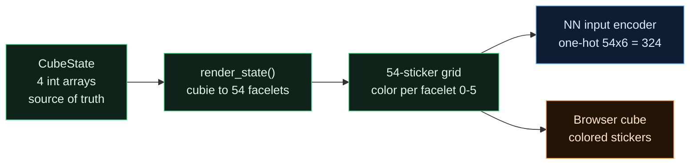
```mermaid
graph LR
  s["CubeState<br/>4 int arrays<br/>source of truth"] --> r["render_state()<br/>cubie to 54 facelets"]
  r --> v["54-sticker grid<br/>color per facelet 0-5"]
  v --> nn["NN input encoder<br/>one-hot 54x6 = 324"]
  v --> ui["Browser cube<br/>colored stickers"]
  classDef core fill:#10231a,stroke:#46d98a,color:#dff7ea;
  classDef rl fill:#0f1d33,stroke:#54a0ff,color:#dcecff;
  classDef pres fill:#241405,stroke:#ff9d42,color:#ffe6cc;
  class s,r,v core;
  class nn rl;
  class ui pres;
```

> The NN encoder turns the 54 colors into a one-hot 54×6 = 324-dim vector — the
> DeepCubeA input convention. The browser turns the same 54 colors directly into
> sticker faces, needing no cube logic of its own.

---

## 07 · Move-System Contract · D2

The six face turns `{R,L,U,D,F,B}` **generate the entire cube group** — every
reachable state is reachable with face turns alone. So the agent needs nothing
else. The full set a *human* might want still lives in a registry; the agent
samples a named subset of it.

**FIG 07.1 — Move registry: what the system knows vs. what the agent uses vs. what the human uses**

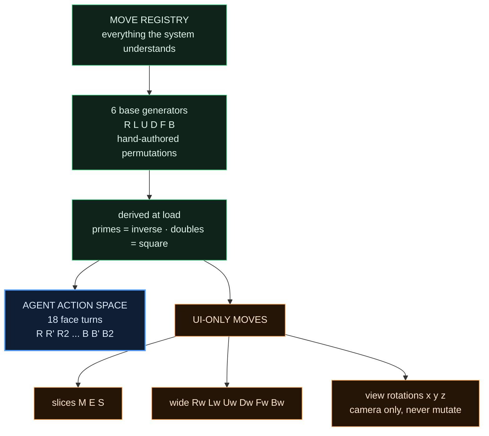
```mermaid
graph TD
  reg["MOVE REGISTRY<br/>everything the system understands"]
  gen["6 base generators<br/>R L U D F B<br/>hand-authored permutations"]
  der["derived at load<br/>primes = inverse · doubles = square"]
  reg --> gen --> der
  der --> agent["AGENT ACTION SPACE<br/>18 face turns<br/>R R' R2 ... B B' B2"]
  der --> uionly["UI-ONLY MOVES"]
  uionly --> sl["slices M E S"]
  uionly --> wd["wide Rw Lw Uw Dw Fw Bw"]
  uionly --> vw["view rotations x y z<br/>camera only, never mutate"]
  classDef core fill:#10231a,stroke:#46d98a,color:#dff7ea;
  classDef agent fill:#0f1d33,stroke:#54a0ff,color:#dcecff,stroke-width:2px;
  classDef pres fill:#241405,stroke:#ff9d42,color:#ffe6cc;
  class reg,gen,der core;
  class agent agent;
  class uionly,sl,wd,vw pres;
```

### Why the extras are excluded from the agent

- **x / y / z** reorient the whole cube — a solved cube stays solved after a rotation, so they carry zero information toward solving.
- **Wide moves** (`Rw = R · M'`) are a face turn composed with a slice; the agent can already express that in two atomic moves, so they add no reachability. With no hand, ergonomic shortcuts are meaningless to the agent.
- **Slices** (M E S) move the *center* pieces, which would force tracking center orientation and break the O(1) solved-check. Redundant and costly for the agent.

### How this resolves the UI question

Moves split into two kinds, and the split maps cleanly onto when each is allowed:

**FIG 07.2 — Camera moves vs. state moves (permission depends on agent run-mode, see FIG 08.2)**

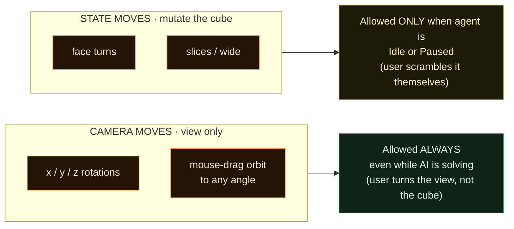
```mermaid
graph LR
  subgraph CAM["CAMERA MOVES  ·  view only"]
    c1["x / y / z rotations"]
    c2["mouse-drag orbit<br/>to any angle"]
  end
  subgraph ST["STATE MOVES  ·  mutate the cube"]
    s1["face turns"]
    s2["slices / wide"]
  end
  CAM --> always["Allowed ALWAYS<br/>even while AI is solving<br/>(user turns the view, not the cube)"]
  ST --> gated["Allowed ONLY when agent is<br/>Idle or Paused<br/>(user scrambles it themselves)"]
  classDef pres fill:#241405,stroke:#ff9d42,color:#ffe6cc;
  classDef ok fill:#10231a,stroke:#46d98a,color:#dff7ea;
  classDef gate fill:#1c1a07,stroke:#ffd23f,color:#fff3c4;
  class c1,c2,s1,s2 pres;
  class always ok;
  class gated gate;
```

### Registry schema (the contract)

You hand-author **six** generator permutation tables once; the loader derives the
other ~40 moves and the test suite proves them (§17). **Adding a move is a config
edit, not a code change** — customizability satisfied by data.

```jsonc
// config/moves.json — structure is the contract; permutation arrays authored & tested in Phase 1
{
  "schema_version": 1,
  "base_generators": {        // ONLY hand-authored data
    "R": { "cp":[], "co":[], "ep":[], "eo":[] },
    "U": {}, "F": {}, "L": {}, "D": {}, "B": {}
  },
  "derived": { "primes": "inverse", "doubles": "square" },
  "agent_action_space": [    // the only moves the policy samples
    "R","R'","R2","U","U'","U2","F","F'","F2",
    "L","L'","L2","D","D'","D2","B","B'","B2"
  ],
  "ui_only_moves": {
    "wide":   ["Rw","Rw'","Rw2","..."],
    "slices": ["M","M'","M2","E","E'","E2","S","S'","S2"],
    "view_rotations": ["x","y","z","x'","y'","z'"]   // CAMERA only
  }
}
```

---

## 08 · Environment Contract · D4

The environment exposes a minimal, custom API — deliberately *not* Gymnasium, so
the action handling is fully ours. A thin Gym adapter exists only as a fallback if
we later want a third-party baseline. Two classes: a readable single-cube env, and
the vectorized env that does the real work.

```python
# env/cube_env.py — single-cube reference implementation (clarity first)
class CubeEnv:
    def reset(self, scramble_depth: int) -> Obs: ...        # new scramble; returns observation
    def step(self, action: int) -> tuple[Obs, float, bool, dict]:
        # returns (obs, reward, done, info)
    def observation(self) -> Obs: ...                        # 324-d one-hot (FIG 06.2)
    action_space: int = 18

# env/vec_env.py — N cubes in ONE tensor; this is the performance path
class VecCubeEnv:
    def reset(self, depths: Tensor) -> Tensor: ...            # [N] depths -> [N, 324] obs
    def step(self, actions: Tensor) -> tuple[Tensor, Tensor, Tensor, dict]:
        # [N] actions -> ([N,324] obs, [N] reward, [N] done, info)
        # a move = ONE gather over an [N, state] tensor — no per-agent loop
```

### Observation, reward, termination

| Field | Definition |
|---|---|
| observation | One-hot encoding of the 54-sticker view → 324-dim vector (or [N,324] batched). |
| reward | **Deferred to a research pass.** ADI's primary signal is the depth label on generated states, not step reward; exact shaping weights live in `config/default.json` and don't affect the architecture. |
| done | `True` when `is_solved()`, or when the step limit for the episode is reached. |
| info | Diagnostics: current depth, step count, solved flag, value estimate. |

### Episode lifecycle

**FIG 08.1 — The state machine of a single episode**

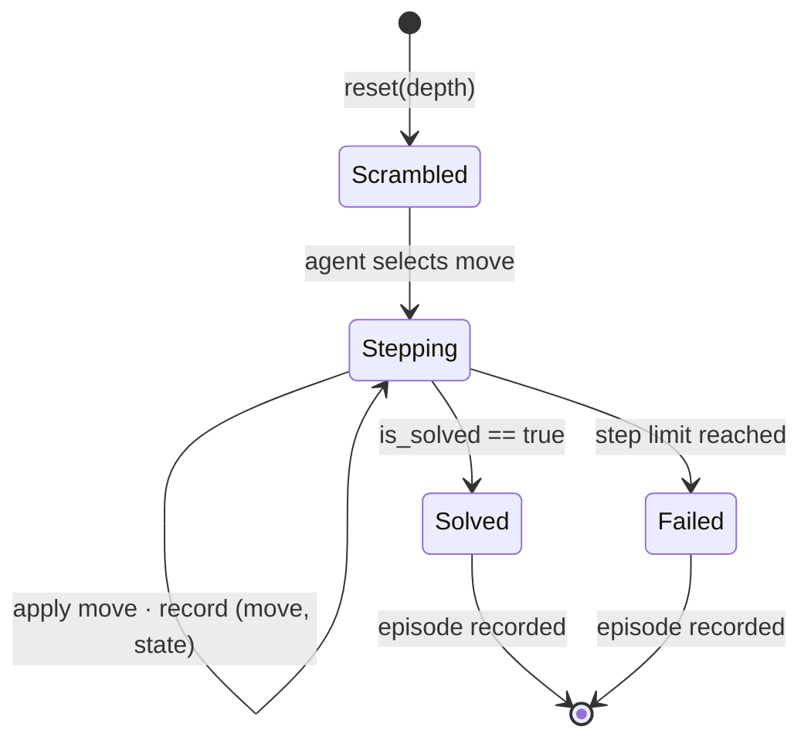
```mermaid
stateDiagram-v2
  [*] --> Scrambled : reset(depth)
  Scrambled --> Stepping : agent selects move
  Stepping --> Stepping : apply move · record (move, state)
  Stepping --> Solved : is_solved == true
  Stepping --> Failed : step limit reached
  Solved --> [*] : episode recorded
  Failed --> [*] : episode recorded
```

### Agent run-modes (drives UI permissions, FIG 07.2)

**FIG 08.2 — When idle/paused the human may apply state moves; while solving, only camera moves**

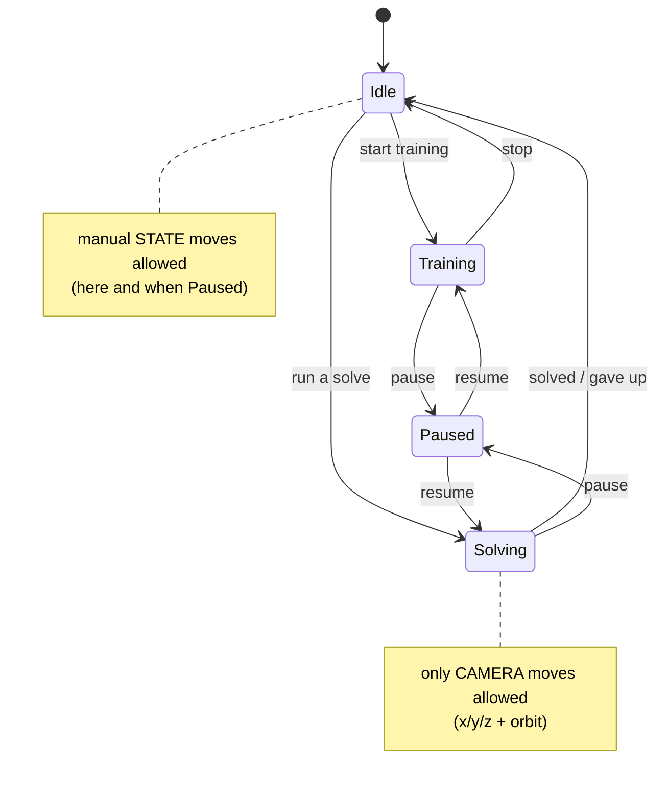
```mermaid
stateDiagram-v2
  [*] --> Idle
  Idle --> Training : start training
  Training --> Paused : pause
  Paused --> Training : resume
  Training --> Idle : stop
  Idle --> Solving : run a solve
  Solving --> Idle : solved / gave up
  Solving --> Paused : pause
  Paused --> Solving : resume
  note right of Idle
    manual STATE moves allowed
    (here and when Paused)
  end note
  note right of Solving
    only CAMERA moves allowed
    (x/y/z + orbit)
  end note
```

---

## 09 · RL Pipeline — Autodidactic Iteration · D3

ADI never needs a labeled "solution" dataset. It manufactures its own supervision
by walking backward from solved, learns a function estimating how far any state is
from solved, then uses that estimate as a search heuristic.

**FIG 09.1 — End-to-end ADI pipeline: data generation → training → search → recorded solution**

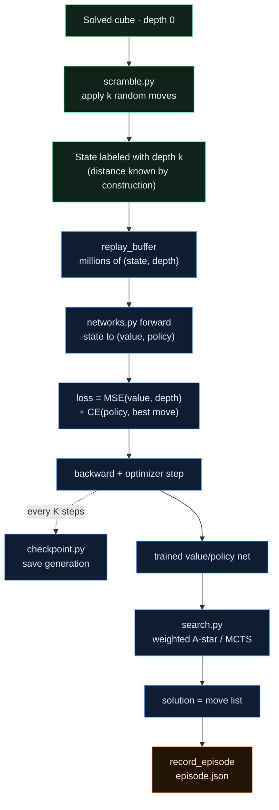
```mermaid
graph TD
  s0["Solved cube · depth 0"] --> sc["scramble.py<br/>apply k random moves"]
  sc --> lab["State labeled with depth k<br/>(distance known by construction)"]
  lab --> buf["replay_buffer<br/>millions of (state, depth)"]
  buf --> fwd["networks.py forward<br/>state to (value, policy)"]
  fwd --> loss["loss = MSE(value, depth)<br/>+ CE(policy, best move)"]
  loss --> upd["backward + optimizer step"]
  upd -. "every K steps" .-> ck["checkpoint.py<br/>save generation"]
  upd --> trained["trained value/policy net"]
  trained --> srch["search.py<br/>weighted A-star / MCTS"]
  srch --> sol["solution = move list"]
  sol --> rec["record_episode<br/>episode.json"]
  classDef core fill:#10231a,stroke:#46d98a,color:#dff7ea;
  classDef rl fill:#0f1d33,stroke:#54a0ff,color:#dcecff;
  classDef pres fill:#241405,stroke:#ff9d42,color:#ffe6cc;
  class s0,sc,lab core;
  class buf,fwd,loss,upd,ck,trained,srch,sol rl;
  class rec pres;
```

### The training loop, step by step

**FIG 09.2 — One ADI training iteration as a sequence of calls**

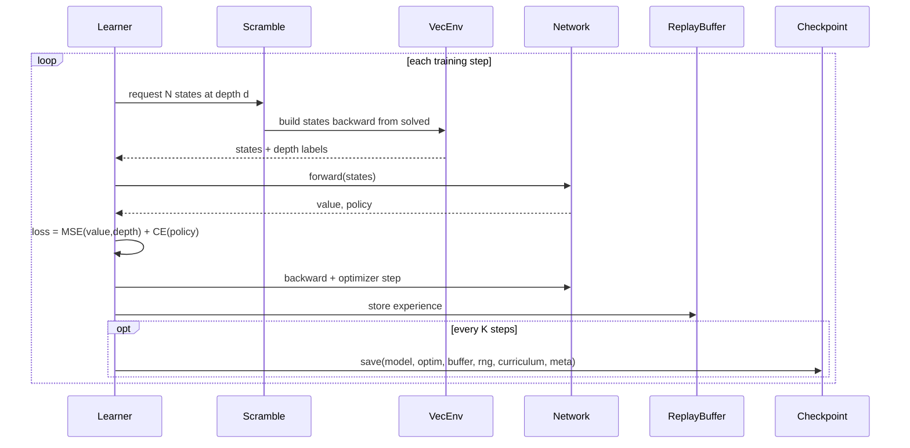
```mermaid
sequenceDiagram
  participant L as Learner
  participant S as Scramble
  participant V as VecEnv
  participant N as Network
  participant B as ReplayBuffer
  participant C as Checkpoint
  loop each training step
    L->>S: request N states at depth d
    S->>V: build states backward from solved
    V-->>L: states + depth labels
    L->>N: forward(states)
    N-->>L: value, policy
    L->>L: loss = MSE(value,depth) + CE(policy)
    L->>N: backward + optimizer step
    L->>B: store experience
    opt every K steps
      L->>C: save(model, optim, buffer, rng, curriculum, meta)
    end
  end
```

### Network architecture (DeepCubeA-style)

A feed-forward body with two heads — deliberately simple, because the cube's
structure does the heavy lifting, not the network's depth.

```python
# rl/networks.py — sketch
input  : 324            # one-hot 54 facelets x 6 colors
body   : FC 5000 -> BN -> ReLU
         FC 1000 -> BN -> ReLU
         + residual blocks
heads  :
  value  : FC -> 1          # scalar cost-to-go (regression target = depth)
  policy : FC -> 18         # logits over the 18 face moves
```

### Search: turning a value estimate into moves

`search.py` runs **weighted A\*** over the learned value: from the scrambled state,
expand the frontier preferring states the network rates as closest to solved,
until the solved state is reached. The result is a move list — the solution.
Weighting trades solution length against search effort, and the weight is a config
knob.

> **◆ The optional warm-start, and what an "oracle" is.** An **oracle** is just a
> function you trust to return a correct solution (e.g. a classical solver). An
> **expert trajectory** is the `(state → move)` pairs along such a solution. The
> elegant part: because we scramble *backward* from solved, **the reverse of the
> scramble is itself a valid solution** from the scrambled state. So every generated
> scramble ships with its own free expert trajectory — its reverse. We can
> behaviour-clone on those (the "show the kid a rule after they've tried"
> warm-start) with **zero dependencies**, then let ADI improve past imitation. No
> external solver ever sits in the gradient path.

---

## 10 · Parallelism & Scaling

Because a move is a fixed index permutation (§06), applying it to N cubes is a
**single tensor operation** — one `gather` over an `[N, state]` tensor. There is no
per-agent Python loop, so stepping 1,000 cubes costs barely more than stepping one.
This is the entire reason the worker count is a free parameter.

**FIG 10.1 — Data-parallel learning: N actors feed one shared learner (the chosen paradigm)**

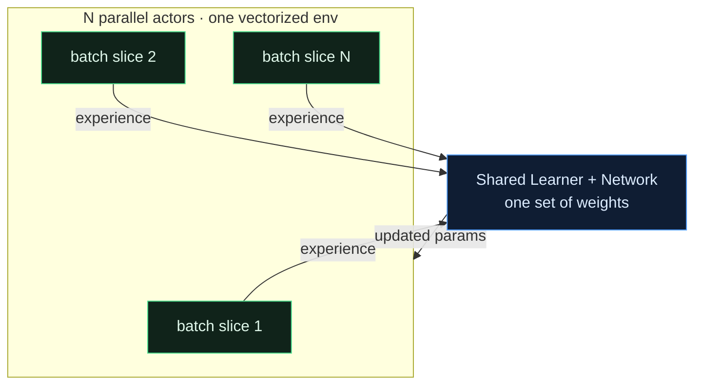
```mermaid
graph TD
  L["Shared Learner + Network<br/>one set of weights"]
  subgraph ACT["N parallel actors  ·  one vectorized env"]
    A1["batch slice 1"]
    A2["batch slice 2"]
    A3["batch slice N"]
  end
  A1 -->|"experience"| L
  A2 -->|"experience"| L
  A3 -->|"experience"| L
  L -->|"updated params"| ACT
  classDef rl fill:#0f1d33,stroke:#54a0ff,color:#dcecff;
  classDef core fill:#10231a,stroke:#46d98a,color:#dff7ea;
  class L rl;
  class A1,A2,A3 core;
```

| Paradigm | What "combine learning" means | Fit here |
|---|---|---|
| Data-parallel RL | N actors collect experience → **one shared network** updates from the aggregate. Standard, proven, fits ADI. | ✅ USING |
| Population-based | N **separate** networks with selection + mutation ("best 3 per generation"). Sample-inefficient as the core learner. | 🟧 PBT over hyperparams only |

> Population-based methods are the ones most hobby write-ups show, which is why
> they felt like the default — but for this problem data-parallel learning is both
> standard and far more sample-efficient. PBT is kept as an optional layer that
> tunes hyperparameters (learning rate, search weight, temperature), not as the
> learner.

---

## 11 · Time & Speed Control · D7

The trainer is never literally slowed to watch it. The simulation runs flat-out
and **records** each episode; the UI "speed" is the playback rate over a recording.
The two clocks are fully decoupled and meet only at one shared artifact — the
episode JSON.

**FIG 11.1 — Decoupled clocks: simulation records, playback replays at any speed**

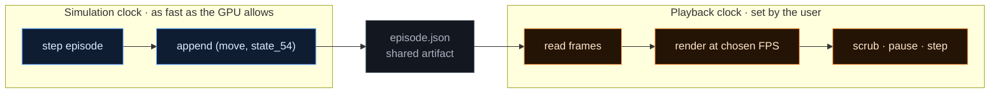
```mermaid
graph LR
  subgraph SIM["Simulation clock  ·  as fast as the GPU allows"]
    t1["step episode"] --> t2["append (move, state_54)"]
  end
  t2 --> ep["episode.json<br/>shared artifact"]
  ep --> P
  subgraph PLAY["Playback clock  ·  set by the user"]
    P["read frames"] --> q1["render at chosen FPS"]
    q1 --> q2["scrub · pause · step"]
  end
  classDef rl fill:#0f1d33,stroke:#54a0ff,color:#dcecff;
  classDef pres fill:#241405,stroke:#ff9d42,color:#ffe6cc;
  classDef neu fill:#13171f,stroke:#3a4658,color:#aab3c2;
  class t1,t2 rl;
  class P,q1,q2 pres;
  class ep neu;
```

The episode format carries the post-move **54-sticker view** for every frame, so
the browser can render and scrub without running any cube logic — honouring "the
browser knows nothing about the core."

---

## 12 · Checkpoint Schema — Pause, Save, Resume

A correct resume restores **everything that affects what happens next**. Reloading
weights alone silently resets the optimizer, the data distribution, and the random
stream, so training jolts on resume. The checkpoint captures the full run state.

**FIG 12.1 — Checkpoint bundle: every field needed for a seamless resume**

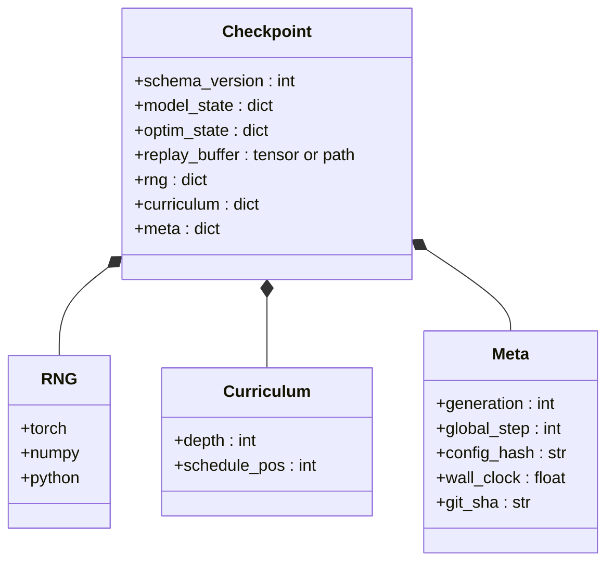
```mermaid
classDiagram
  class Checkpoint {
    +schema_version : int
    +model_state : dict
    +optim_state : dict
    +replay_buffer : tensor or path
    +rng : dict
    +curriculum : dict
    +meta : dict
  }
  class RNG {
    +torch
    +numpy
    +python
  }
  class Curriculum {
    +depth : int
    +schedule_pos : int
  }
  class Meta {
    +generation : int
    +global_step : int
    +config_hash : str
    +wall_clock : float
    +git_sha : str
  }
  Checkpoint *-- RNG
  Checkpoint *-- Curriculum
  Checkpoint *-- Meta
```

**FIG 12.2 — Save**

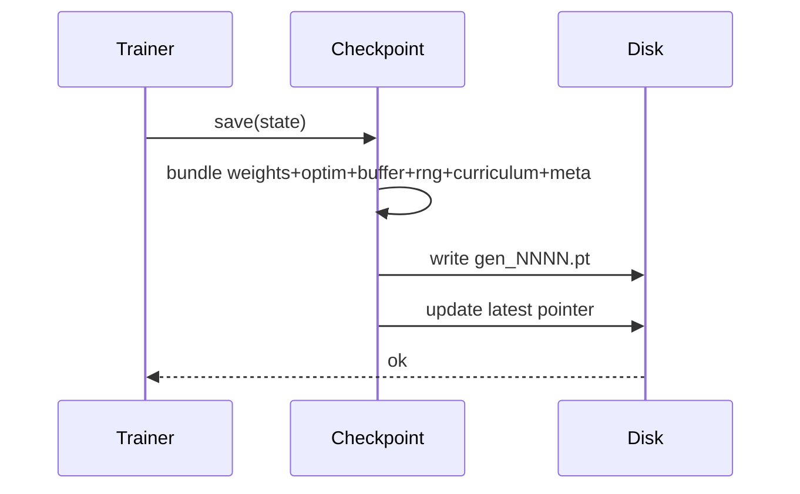
```mermaid
sequenceDiagram
  participant T as Trainer
  participant C as Checkpoint
  participant D as Disk
  T->>C: save(state)
  C->>C: bundle weights+optim+buffer+rng+curriculum+meta
  C->>D: write gen_NNNN.pt
  C->>D: update latest pointer
  D-->>T: ok
```

**FIG 12.3 — Resume**

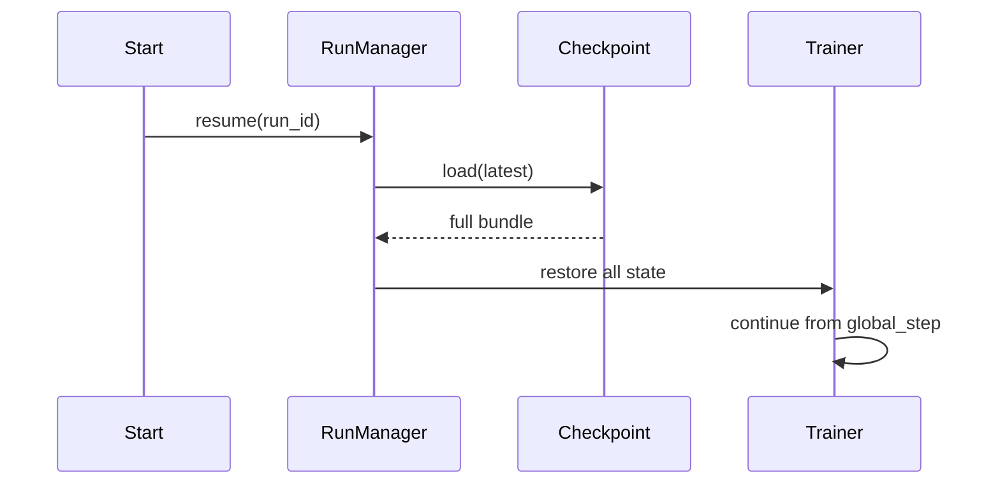
```mermaid
sequenceDiagram
  participant U as Start
  participant R as RunManager
  participant C as Checkpoint
  participant T as Trainer
  U->>R: resume(run_id)
  R->>C: load(latest)
  C-->>R: full bundle
  R->>T: restore all state
  T->>T: continue from global_step
```

### On-disk layout

```text
checkpoints/
└── <run_id>/
    ├── gen_0001.pt        # torch.save bundle (FIG 12.1)
    ├── gen_0042.pt
    ├── latest             # pointer/symlink to newest generation
    ├── config.json        # exact config this run was launched with
    └── metrics.csv        # per-generation: solve-rate, loss, depth, time
```

> Checkpoints are large binaries → `checkpoints/` is git-ignored (§15). You pause
> anytime and resume later with no loss and bit-for-bit continuation of the random
> stream.

---

## 13 · Presentation Layer · D5 + D6

The goal is a cube that *looks like a cube*: real colored stickers, free rotation
to any angle, and a visible animation for every turn — never a jump-cut between
states. CSS 3D transforms deliver all of it with no framework. Two phases share
one renderer.

### The Python ↔ browser contract: episode JSON

```jsonc
// web/episodes/*.json — the ONLY thing crossing the Python/browser boundary in static mode
{
  "schema_version": 1,
  "cube_size": 3,
  "scramble":  ["R","U2","F'","..."],     // moves applied to build the start state
  "start_state": { "cp":[], "co":[], "ep":[], "eo":[] },
  "solution":  ["U","R'","F2","..."],      // the agent's moves
  "frames": [                              // one per move — enables animation + scrub
    { "move":"U", "state_54":[/* 54 ints 0-5 */], "value":12.3 }
  ],
  "meta": { "solver":"adi", "checkpoint":"gen_0042", "solved":true, "len":21 }
}
```

| 🟧 D5-A · Static playground — **FIRST** | 🟦 D5-B · Live dashboard — **LATER** |
|---|---|
| Pure HTML/CSS/JS. The browser reads a recorded JSON episode and plays it — **zero backend**. Anyone opens `index.html` and watches a solve; models save locally. This is the open-source deliverable. | A small Python program running during training that serves the same `web/` files *and* opens a WebSocket so the page shows agents live and sends start / pause / resume / speed / checkpoint commands. Not required to ship. |

**FIG 13.1 — Static mode: the whole interaction, no server involved**

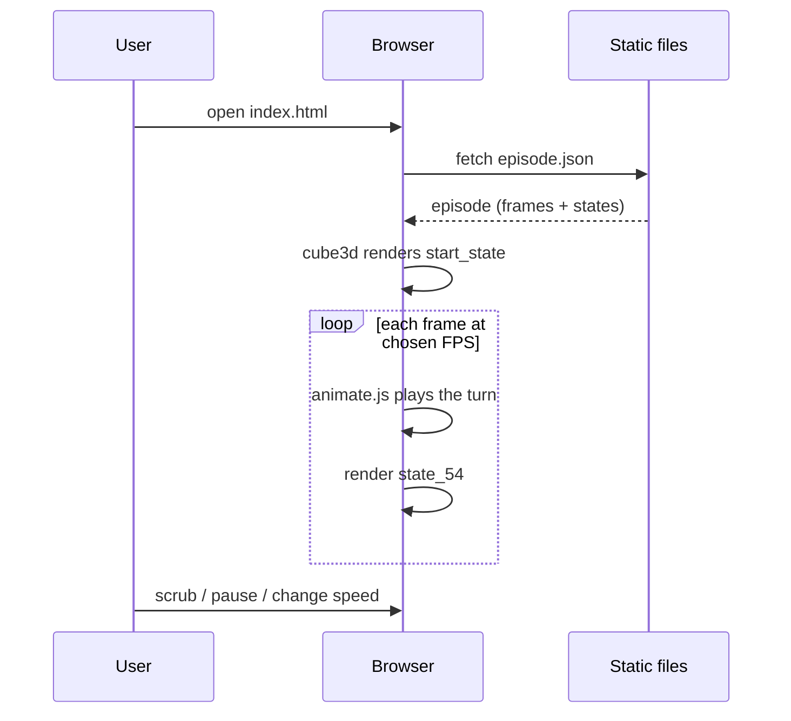
```mermaid
sequenceDiagram
  participant U as User
  participant B as Browser
  participant F as Static files
  U->>B: open index.html
  B->>F: fetch episode.json
  F-->>B: episode (frames + states)
  B->>B: cube3d renders start_state
  loop each frame at chosen FPS
    B->>B: animate.js plays the turn
    B->>B: render state_54
  end
  U->>B: scrub / pause / change speed
```

**FIG 13.2 — Live mode: same renderer, plus a control + stream channel**

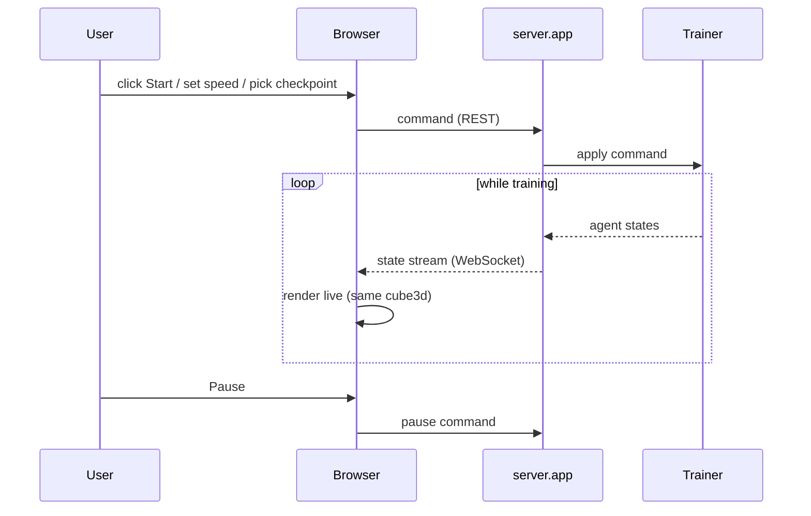
```mermaid
sequenceDiagram
  participant U as User
  participant B as Browser
  participant S as server.app
  participant T as Trainer
  U->>B: click Start / set speed / pick checkpoint
  B->>S: command (REST)
  S->>T: apply command
  loop while training
    T-->>S: agent states
    S-->>B: state stream (WebSocket)
    B->>B: render live (same cube3d)
  end
  U->>B: Pause
  B->>S: pause command
```

**FIG 13.3 — Manual scramble: gated by run-mode (FIG 08.2); camera is always free**

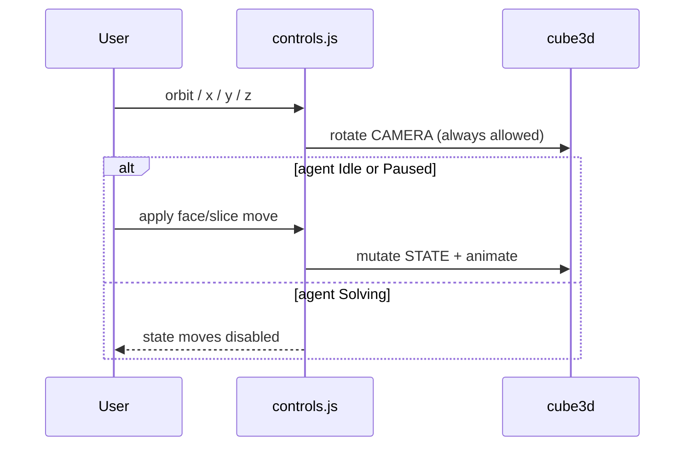
```mermaid
sequenceDiagram
  participant U as User
  participant C as controls.js
  participant Cube as cube3d
  U->>C: orbit / x / y / z
  C->>Cube: rotate CAMERA (always allowed)
  alt agent Idle or Paused
    U->>C: apply face/slice move
    C->>Cube: mutate STATE + animate
  else agent Solving
    C-->>U: state moves disabled
  end
```

### Rendering ladder (D6)

| Stage | Tech | When |
|---|---|---|
| **A · now** | CSS 3D transforms — 27 cubie divs, colored stickers, mouse-orbit, animated face turns | Build first; all functionality present |
| **B · later** | Canvas 2D isometric | If more rendering control is wanted |
| **C · future** | Three.js / WebGL | Only for lighting / reflections / photorealism |

> CSS 3D satisfies everything described — colored stickers, free orbit, animated
> turns — except photorealism, the sole reason to reach for Three.js. The static
> playground is the gentlest entry point; the live server is introduced only at
> Phase 6.

---

## 14 · Repository Layout

Colour = subsystem · 🟩 core / 🟦 rl / 🟧 presentation · *italic = optional*

```text
rubiks-rl/
├── README.md
├── pyproject.toml                 # pinned deps (or requirements.txt)
├── Dockerfile                     # OPTIONAL · dev / train only
├── config/
│   ├── default.json               # hyperparams, curriculum, reward weights, search weight
│   └── moves.json                 # move registry = permutations (§07)
├── core/                          # PURE · no torch, no web
│   ├── cube.py                    # cubie state (§06) + solved-check + serialize
│   ├── moves.py                   # load 6 generators, derive rest, apply single + batched
│   ├── scramble.py                # backward-from-solved, depth-labeled (§05, §09)
│   ├── render_state.py            # cubie to 54-sticker projection (NN + UI)
│   └── solver_classical.py        # OPTIONAL oracle · BC / eval only (§09)
├── env/
│   ├── cube_env.py                # single env · reset/step/obs/reward/done (§08)
│   ├── vec_env.py                 # N cubes as one tensor — the speed win (§10)
│   └── gym_adapter.py             # OPTIONAL Gymnasium wrapper (D4 fallback)
├── rl/                            # TORCH ONLY
│   ├── networks.py                # value + policy net (§09)
│   ├── adi.py                     # autodidactic iteration (core learner)
│   ├── ppo.py / dqn.py            # OPTIONAL alternate learners (§16)
│   ├── search.py                  # weighted A* / MCTS over learned value
│   ├── replay_buffer.py
│   ├── curriculum.py              # scramble-depth scheduler
│   └── population.py              # OPTIONAL PBT over hyperparams (§10)
├── training/
│   ├── train.py                   # entrypoint · spawn N actors + learner
│   ├── checkpoint.py              # save/load full run state (§12)
│   ├── run_manager.py             # experiment dirs · resume logic
│   └── distributed.py             # parallel actor orchestration
├── server/                        # bridge · Phase 6 (D5-B)
│   ├── app.py                     # FastAPI (or stdlib http) + static serving
│   ├── ws.py                      # websocket stream of agent states
│   └── api.py                     # start / pause / resume / speed / checkpoint
├── web/                           # FROM SCRATCH · CSS 3D (D6-A)
│   ├── index.html
│   ├── css/cube.css               # CSS 3D transforms + turn animations
│   ├── js/
│   │   ├── cube3d.js              # render from 54-sticker view
│   │   ├── animate.js             # playback speed, decoupled from sim (§11)
│   │   ├── controls.js            # manual moves, scramble, agent select
│   │   ├── player.js              # static replay · no backend (D5-A)
│   │   └── ws_client.js           # live mode (D5-B)
│   └── episodes/                  # sample JSON episodes for the static player
├── checkpoints/                   # GIT-IGNORED · runs / generations (§12, §15)
├── tests/
│   ├── test_moves.py              # R^4=I · (R U R' U')x6=I · batched==looped
│   ├── test_solved.py
│   └── test_vec_env.py
├── scripts/
│   ├── record_episode.py          # emit episode.json for the static player
│   └── benchmark_env.py           # moves/sec at N envs
└── docs/
    ├── DRD.md                     # THIS document, in repo form
    ├── architecture.md
    └── move_notation.md           # axis conventions · R/L/U/D/F/B · M/E/S
```

### Module responsibilities at a glance

| Module | Owns | Layer |
|---|---|---|
| core.cube | State representation, invariants, solved-check, serialize | 🟩 core |
| core.moves | Permutation load/derive; single + batched application | 🟩 core |
| core.scramble | Backward depth-labeled scramble generation | 🟩 core |
| env.vec_env | N-cube tensor env; the performance path | 🟩 core |
| rl.adi | The learning loop; produces trained nets + checkpoints | 🟦 rl |
| rl.search | Weighted A* over the value net → solutions | 🟦 rl |
| training.checkpoint | Full-state save/resume | 🟦 rl |
| web.player + cube3d | Episode replay + colored CSS-3D rendering | 🟧 pres |
| server.app | Live serving + control + state stream (Phase 6) | 🟧 pres |

---

## 15 · Dependencies

| Tier | Dependency | Used in | Justification | From-scratch alt. |
|---|---|---|---|---|
| 0 | Python stdlib | everywhere | — | — |
| 0 | NumPy *(opt)* | core / env | Only if vec_env isn't torch-native | **drop it** — pure torch tensors |
| 1 | **PyTorch** | rl/ only | Not reimplementing autograd + CUDA | none — don't |
| 2 | JSON (stdlib) | config | Avoids a dependency entirely | — |
| 2 | PyYAML *(alt)* | config | Only if hand-edited comments wanted | JSON |
| 3 | **FastAPI + uvicorn** | server (live) | Async WS + static serving, ~an afternoon saved | stdlib `http.server` + `websockets` |
| 4 | kociemba *(opt)* | oracle only | Two-phase solver is a project itself | IDA* + pattern DBs (multi-week) |
| FE | **none** | web/ | CSS 3D needs no framework | — (Three.js only for photorealism) |
| test | pytest *(or unittest)* | tests/ | Nicer ergonomics | stdlib `unittest` |

| 🟩 Consumer playground footprint | 🟦 Trainer footprint |
|---|---|
| **Zero Python · zero npm.** Just static files — open `index.html`. No install, no Docker. What makes it trivial for a non-technical user. | **PyTorch + stdlib.** Everything else opt-in. The pure core means a contributor can read and test the cube logic without installing torch at all. |

> **◆ A note on Git & Docker, for later.** Model files are large binaries →
> `checkpoints/` is git-ignored; trained models ship via GitHub **Releases** or Git
> LFS, not commit history. Contributors **fork** or **branch**, then open a pull
> request you review. Docker only reproduces the *training* environment for
> contributors and would *raise* the barrier for non-technical users — so it stays
> off the consumer path, optional and dev-only.

---

## 16 · Extension Workflows

### Adding a new move

Because moves are data, extending the move set never touches Python logic.

**FIG 16.1 — Add-a-move: a config edit, proven by tests, instantly available**

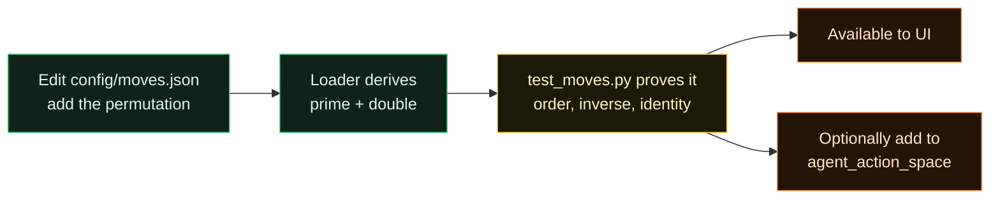
```mermaid
graph LR
  e1["Edit config/moves.json<br/>add the permutation"] --> e2["Loader derives<br/>prime + double"]
  e2 --> e3["test_moves.py proves it<br/>order, inverse, identity"]
  e3 --> e4["Available to UI"]
  e3 --> e5["Optionally add to<br/>agent_action_space"]
  classDef core fill:#10231a,stroke:#46d98a,color:#dff7ea;
  classDef gate fill:#1c1a07,stroke:#ffd23f,color:#fff3c4;
  classDef pres fill:#241405,stroke:#ff9d42,color:#ffe6cc;
  class e1,e2 core;
  class e3 gate;
  class e4,e5 pres;
```

### Adding a new learner (Curriculum, HER, …)

All learners implement one `Trainer` interface, so `training.train` depends on the
abstraction, not any concrete learner. Adding HER means writing one class — no
changes to the entrypoint, env, or checkpointing.

**FIG 16.2 — The pluggable Trainer interface: v1 ships ADITrainer; the rest slot in later**

```mermaid
classDiagram
  class Trainer {
    <<interface>>
    +train_step()
    +evaluate()
    +state_dict() dict
    +load_state_dict(d)
  }
  class ADITrainer
  class CurriculumTrainer
  class HERTrainer
  class TrainEntrypoint
  Trainer <|.. ADITrainer
  Trainer <|.. CurriculumTrainer
  Trainer <|.. HERTrainer
  TrainEntrypoint ..> Trainer : depends on interface
  note for ADITrainer "v1 · the only concrete learner at launch"
  note for CurriculumTrainer "Phase 7"
  note for HERTrainer "Phase 7"
```

---

## 17 · Testing Strategy

The cube core is small and its correctness is fully checkable by algebraic
identities. These tests are the gate for Phase 1 and run in CI on every change.

**FIG 17.1 — Test layers and what each protects**

```mermaid
graph TD
  subgraph CORE_T["core correctness"]
    m1["face^4 == identity<br/>(any quarter turn, 4x)"]
    m2["(R U R' U') x 6 == identity<br/>the sexy-move check"]
    m3["move · inverse == identity"]
    m4["solved-check true only when solved"]
  end
  subgraph ENV_T["env correctness"]
    v1["vectorized step == looped single step"]
    v2["scramble at depth d is solvable in at most d"]
  end
  subgraph RL_T["learning sanity"]
    r1["value decreases toward solved"]
    r2["solve-rate climbs with training"]
  end
  CORE_T --> G1{"Phase 1 GATE"}
  ENV_T --> G2{"Phase 2 GATE"}
  classDef core fill:#10231a,stroke:#46d98a,color:#dff7ea;
  classDef rl fill:#0f1d33,stroke:#54a0ff,color:#dcecff;
  classDef gate fill:#1c1a07,stroke:#ffd23f,color:#fff3c4;
  class m1,m2,m3,m4,v1,v2 core;
  class r1,r2 rl;
  class G1,G2 gate;
```

| Test | Asserts | Catches |
|---|---|---|
| R⁴ = I | Four quarter-turns of any face return to start | Wrong permutation cycles |
| (R U R' U')×6 = I | The "sexy move" has order 6 | Subtle composition / orientation bugs |
| move·inverse = I | Every derived prime undoes its base | Bad inverse derivation |
| vec == looped | Batched step equals N single steps | Vectorization errors |
| depth solvable | A depth-d scramble's reverse solves it in ≤ d | Scramble/inverse mismatch |

> **Note (added after Phase 1):** R⁴=I, move·inverse=I, M2=M·M, and scramble
> round-trips pass *by construction* because primes/doubles/inverses are derived
> from the same tables — they prove self-consistency, not geometric correctness.
> Add **external** validators that don't depend on the derivation: known element
> orders such as `|R U| = 105`, `|F R| = 105`, `|R U'| = 63`, `|R U2| = 30`,
> `|R L| = 4` (opposite faces commute). `|R U| = 105` is the classic catcher for a
> wrong table.

---

## 18 · Roadmap & Milestones

Vertical slices — each phase ends on a concrete, testable gate.

**FIG 18.1 — Build sequence: phases advance only through gates**

```mermaid
graph LR
  P0["Phase 0<br/>Foundations<br/>repo + schemas + DRD"] --> P1["Phase 1<br/>Cube core<br/>cube/moves/tests"]
  P1 --> G1{"GATE<br/>move algebra<br/>tests pass"}
  G1 --> P2["Phase 2<br/>Environment<br/>vec_env + scramble"]
  P2 --> G2{"GATE<br/>vec==single<br/>benchmark"}
  G2 --> P3["Phase 3<br/>ADI core<br/>net + loop + search"]
  P3 --> G3{"GATE<br/>solves shallow<br/>scrambles"}
  G3 --> P4["Phase 4<br/>Training infra<br/>parallel + checkpoint"]
  P4 --> G4{"GATE<br/>pause/resume<br/>reproduces"}
  G4 --> P5["Phase 5<br/>Static playground<br/>CSS-3D + player"]
  P5 --> G5{"GATE<br/>user watches<br/>a solve"}
  G5 --> P6["Phase 6<br/>Live dashboard<br/>FastAPI + WS"]
  P6 --> P7["Phase 7<br/>Research ext.<br/>Curriculum / HER / PBT"]
  classDef ph fill:#0f1d33,stroke:#54a0ff,color:#dcecff;
  classDef gate fill:#1c1a07,stroke:#ffd23f,color:#fff3c4;
  classDef later fill:#13171f,stroke:#3a4658,color:#8a94a6;
  class P0,P1,P2,P3,P4,P5 ph;
  class G1,G2,G3,G4,G5 gate;
  class P6,P7 later;
```

| Phase | Deliverable | Exit gate | Status |
|---|---|---|---|
| 0 · Foundations | Repo skeleton, config schemas, this DRD committed | Contracts agreed | ✅ done |
| 1 · Cube core | `core/cube.py`, `core/moves.py`, `tests/test_moves.py` | All move-algebra tests pass | ✅ done |
| 2 · Environment | `cube_env`, `vec_env`, `scramble`, `render_state` | vec==single · benchmark moves/sec at N | 🚧 next |
| 3 · ADI core | `networks`, `adi`, `replay_buffer`, `curriculum`, `search` | Solves shallow scrambles; rate climbs | ⏳ |
| 4 · Training infra | `train`, `checkpoint`, `run_manager`, `distributed` | Pause→resume reproduces; workers scale | ⏳ |
| 5 · Static playground | `web/` CSS-3D cube, player, controls | Non-technical user watches a solve | ⏳ |
| 6 · Live dashboard | `server/` FastAPI + WebSocket | Real-time control + streaming | 🔭 later |
| 7 · Research ext. | Curriculum + HER alternate learners; PBT; Three.js; optimality eval | Cross-strategy comparison | 🔭 future |

> Phases are ordered by dependency, not calendar — each is a vertical slice that
> leaves the project in a working, tested state. No phase begins before the prior
> gate is green.

---

## 19 · Risks & Open Questions

| Risk / question | Impact | Mitigation / when decided |
|---|---|---|
| Reward / cost-to-go shaping not yet fixed | Affects convergence speed, not architecture | Research pass in Phase 3; isolated in `config/default.json` |
| Search cost at deep scrambles | Long solve time / memory in weighted A* | Tune search weight; cap node budget; MCTS fallback |
| Worker scaling ceiling on a given GPU | Caps practical N | `benchmark_env.py` measures it; N stays a config knob |
| BC warm-start may bias the policy | Could slow self-discovery if over-weighted | Keep BC optional + low-weight; ablate against pure ADI |
| Replay buffer size in checkpoints | Large checkpoint files | Store buffer by reference/path option; cap capacity |
| Frontend learning curve | Phase 5 slower than code phases | CSS-3D chosen for minimal surface; static mode first |

---

## 20 · Future Extensions

- **Alternate learners** — Curriculum and HER behind the same `Trainer` interface, so different agents run different strategies and are compared directly (FIG 16.2).
- **Population-based tuning** — PBT over hyperparameters (learning rate, search weight, temperature) layered on top of data-parallel learning — not as the learner.
- **Richer rendering** — Canvas 2D, then Three.js / WebGL for lighting and reflections, reusing the same 54-sticker contract.
- **Optimality & bigger cubes** — optional classical solver to score solution optimality; the cubie model generalises to 4×4+ as a later target.

> **◆ Status.** Phases 0–1 are complete (design locked; cube core built and proven).
> The active deliverable is **Phase 2 — the environment**: `env/vec_env.py`
> (one `torch.gather` step over `[N, …]`), `core/scramble.py`, `core/render_state.py`,
> with the gate being *vectorized step == looped single-state path* plus a moves/sec
> benchmark.
